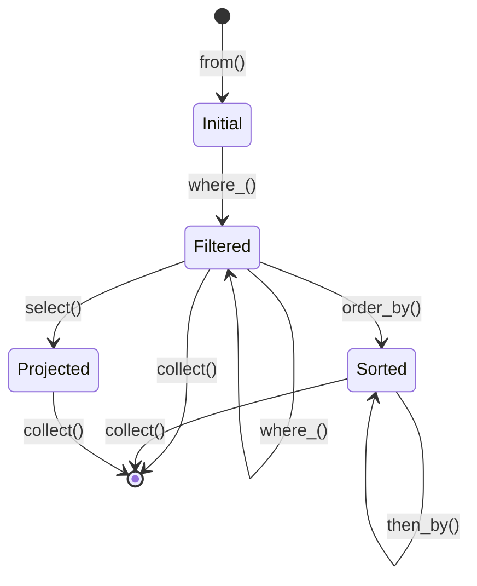

# Design Document

## Overview

RINQ (Rust Integrated Query) v0.1は、Rustの型システムとゼロコスト抽象化を活用した、型安全で高性能なクエリエンジンです。本設計では、In-Memoryコレクションに対するLINQスタイルのクエリAPIを提供し、将来のデータベース統合やWASM対応の基盤を構築します。

### 設計目標

1. **型安全性**: コンパイル時にクエリの正当性を保証
2. **ゼロコスト**: 手書きループと同等のパフォーマンス
3. **流暢なAPI**: メソッドチェーンによる読みやすいクエリ記述
4. **拡張性**: 将来のデータソース追加を容易にする設計
5. **統合性**: rusted-caアーキテクチャとの seamless な統合

## Architecture

### レイヤー構成

```
┌─────────────────────────────────────────────────────────┐
│                   Application Layer                     │
│  (rusted-caのUseCaseからRINQを使用)                     │
└─────────────────────────────────────────────────────────┘
                          ↓
┌─────────────────────────────────────────────────────────┐
│                    RINQ Public API                      │
│  - from() / where_() / select() / order_by()           │
│  - take() / skip() / count() / first() / last()        │
└─────────────────────────────────────────────────────────┘
                          ↓
┌─────────────────────────────────────────────────────────┐
│                   Query Builder Core                    │
│  - QueryBuilder<T, State>                              │
│  - Type State Pattern (Initial, Filtered, Sorted)     │
│  - Iterator Adapters                                   │
└─────────────────────────────────────────────────────────┘
                          ↓
┌─────────────────────────────────────────────────────────┐
│                  Data Source Abstraction                │
│  - InMemorySource<T>                                   │
│  - (Future: DatabaseSource, APISource)                 │
└─────────────────────────────────────────────────────────┘
```

### 型状態パターン

RINQは型状態パターンを使用して、コンパイル時にクエリの正当性を保証します。

```rust
// 状態を表す型
struct Initial;
struct Filtered;
struct Sorted;
struct Projected<U>;

// QueryBuilderは状態を型パラメータとして持つ
struct QueryBuilder<T, State> {
    source: Box<dyn Iterator<Item = T>>,
    _state: PhantomData<State>,
}

// 各状態で許可されるメソッドを定義
impl<T> QueryBuilder<T, Initial> {
    pub fn where_<F>(self, predicate: F) -> QueryBuilder<T, Filtered>
    where
        F: Fn(&T) -> bool,
    { ... }
}

impl<T> QueryBuilder<T, Filtered> {
    pub fn order_by<K, F>(self, key_selector: F) -> QueryBuilder<T, Sorted>
    where
        F: Fn(&T) -> K,
        K: Ord,
    { ... }
    
    pub fn select<U, F>(self, projection: F) -> QueryBuilder<U, Projected<U>>
    where
        F: Fn(T) -> U,
    { ... }
}
```

## Components and Interfaces

### 1. QueryBuilder

クエリ構築の中核となるコンポーネント。

```rust
pub struct QueryBuilder<T, State> {
    source: Box<dyn Iterator<Item = T>>,
    _state: PhantomData<State>,
}

impl<T> QueryBuilder<T, Initial> {
    /// コレクションからQueryBuilderを作成
    pub fn from<I>(source: I) -> Self
    where
        I: IntoIterator<Item = T>,
    { ... }
    
    /// 述語によるフィルタリング
    pub fn where_<F>(self, predicate: F) -> QueryBuilder<T, Filtered>
    where
        F: Fn(&T) -> bool + 'static,
    { ... }
}

impl<T> QueryBuilder<T, Filtered> {
    /// 追加のフィルタリング
    pub fn where_<F>(self, predicate: F) -> QueryBuilder<T, Filtered>
    where
        F: Fn(&T) -> bool + 'static,
    { ... }
    
    /// ソート
    pub fn order_by<K, F>(self, key_selector: F) -> QueryBuilder<T, Sorted>
    where
        F: Fn(&T) -> K + 'static,
        K: Ord,
    { ... }
    
    /// 射影
    pub fn select<U, F>(self, projection: F) -> QueryBuilder<U, Projected<U>>
    where
        F: Fn(T) -> U + 'static,
    { ... }
    
    /// 要素数制限
    pub fn take(self, n: usize) -> QueryBuilder<T, Filtered> { ... }
    
    /// 要素スキップ
    pub fn skip(self, n: usize) -> QueryBuilder<T, Filtered> { ... }
}

impl<T> QueryBuilder<T, Sorted> {
    /// 二次ソート
    pub fn then_by<K, F>(self, key_selector: F) -> QueryBuilder<T, Sorted>
    where
        F: Fn(&T) -> K + 'static,
        K: Ord,
    { ... }
}

// すべての状態で使用可能な終端操作
impl<T, State> QueryBuilder<T, State> {
    /// 結果を収集
    pub fn collect<B>(self) -> B
    where
        B: FromIterator<T>,
    { ... }
    
    /// 要素数を取得
    pub fn count(self) -> usize { ... }
    
    /// 最初の要素を取得
    pub fn first(self) -> Option<T> { ... }
    
    /// 最後の要素を取得
    pub fn last(self) -> Option<T> { ... }
    
    /// いずれかの要素が条件を満たすか
    pub fn any<F>(self, predicate: F) -> bool
    where
        F: Fn(&T) -> bool,
    { ... }
    
    /// すべての要素が条件を満たすか
    pub fn all<F>(self, predicate: F) -> bool
    where
        F: Fn(&T) -> bool,
    { ... }
    
    /// デバッグ用の観察
    pub fn inspect<F>(self, f: F) -> Self
    where
        F: Fn(&T),
    { ... }
}
```

### 2. Queryable Trait

データソースの抽象化。

```rust
pub trait Queryable<T> {
    type Iter: Iterator<Item = T>;
    
    fn into_query(self) -> QueryBuilder<T, Initial>;
}

// Vec<T>への実装
impl<T> Queryable<T> for Vec<T> {
    type Iter = std::vec::IntoIter<T>;
    
    fn into_query(self) -> QueryBuilder<T, Initial> {
        QueryBuilder::from(self)
    }
}

// &[T]への実装
impl<'a, T: Clone> Queryable<T> for &'a [T] {
    type Iter = std::iter::Cloned<std::slice::Iter<'a, T>>;
    
    fn into_query(self) -> QueryBuilder<T, Initial> {
        QueryBuilder::from(self.iter().cloned())
    }
}
```

### 3. RinqError

エラーハンドリング。

```rust
use thiserror::Error;

#[derive(Error, Debug)]
pub enum RinqError {
    #[error("Query execution failed: {message}")]
    ExecutionError { message: String },
    
    #[error("Invalid query state: {message}")]
    InvalidState { message: String },
    
    #[error("Type mismatch: expected {expected}, got {actual}")]
    TypeMismatch { expected: String, actual: String },
}

pub type RinqResult<T> = Result<T, RinqError>;
```

### 4. Metrics Integration

rusted-caのメトリクス収集との統合。

```rust
pub struct MetricsQueryBuilder<T, State> {
    inner: QueryBuilder<T, State>,
    metrics: Arc<MetricsCollector>,
    operation_name: String,
}

impl<T, State> MetricsQueryBuilder<T, State> {
    pub fn new(
        inner: QueryBuilder<T, State>,
        metrics: Arc<MetricsCollector>,
        operation_name: String,
    ) -> Self {
        Self {
            inner,
            metrics,
            operation_name,
        }
    }
    
    // 各メソッドでメトリクスを記録
    pub fn collect<B>(self) -> B
    where
        B: FromIterator<T>,
    {
        let start = std::time::Instant::now();
        let result = self.inner.collect();
        let duration = start.elapsed();
        
        self.metrics.record_query_execution(
            &self.operation_name,
            duration,
        );
        
        result
    }
}
```

## Data Models

### QueryBuilder State Machine



### Core Data Structures

```rust
// クエリビルダーの内部状態
pub struct QueryBuilder<T, State> {
    // イテレータチェーン
    source: Box<dyn Iterator<Item = T>>,
    
    // 型状態マーカー
    _state: PhantomData<State>,
}

// フィルタ述語
type Predicate<T> = Box<dyn Fn(&T) -> bool>;

// 射影関数
type Projection<T, U> = Box<dyn Fn(T) -> U>;

// キーセレクタ
type KeySelector<T, K> = Box<dyn Fn(&T) -> K>;
```

## Correctness Properties

*A property is a characteristic or behavior that should hold true across all valid executions of a system-essentially, a formal statement about what the system should do. 
Properties serve as the bridge between human-readable specifications and machine-verifiable correctness guarantees.*


### Property 1: フィルタリングの正確性
*For any* コレクションと述語、where_()でフィルタリングした結果のすべての要素は、その述語を満たす
**Validates: Requirements 1.2**

### Property 2: 複数フィルタの結合
*For any* コレクションと複数の述語、連鎖したwhere_()の結果は、すべての述語を満たす要素のみを含む
**Validates: Requirements 1.3**

### Property 3: 不変性の保証
*For any* コレクションとクエリ、クエリ実行後も元のコレクションは変更されない
**Validates: Requirements 1.5**

### Property 4: 射影の正確性
*For any* コレクションと射影関数、select()の結果のすべての要素は、射影関数を適用した結果である
**Validates: Requirements 2.1**

### Property 5: フィルタと射影の順序
*For any* コレクション、述語、射影関数、where_().select()の結果は、最初にフィルタリングし、次に射影を適用した結果と等しい
**Validates: Requirements 2.2**

### Property 6: 遅延評価の保証
*For any* クエリ、collect()が呼び出されるまで、射影関数やフィルタ述語は実行されない
**Validates: Requirements 2.5, 4.5**

### Property 7: 昇順ソートの正確性
*For any* コレクションとキーセレクタ、order_by()の結果は、キーに基づいて昇順にソートされている
**Validates: Requirements 3.1**

### Property 8: 降順ソートの正確性
*For any* コレクションとキーセレクタ、order_by_descending()の結果は、キーに基づいて降順にソートされている
**Validates: Requirements 3.2**

### Property 9: 複数キーソートの正確性
*For any* コレクションと複数のキーセレクタ、order_by().then_by()の結果は、最初のキーで一次ソート、次のキーで二次ソートされている
**Validates: Requirements 3.3, 3.4**

### Property 10: 安定ソートの保証
*For any* コレクション、等しいキーを持つ要素は、ソート後も元の相対順序を保持する
**Validates: Requirements 3.5**

### Property 11: take()の正確性
*For any* コレクションとn、take(n)の結果の要素数は、min(n, collection.len())である
**Validates: Requirements 4.1**

### Property 12: skip()の正確性
*For any* コレクションとn、skip(n)の結果は、最初のn個の要素を除いたコレクションである
**Validates: Requirements 4.2**

### Property 13: ページネーションの正確性
*For any* コレクション、skip(n).take(m)の結果は、n番目からm個の要素を含む
**Validates: Requirements 4.3**

### Property 14: count()の正確性
*For any* コレクション、count()の結果は、コレクションの要素数と等しい
**Validates: Requirements 5.1**

### Property 15: first()の正確性
*For any* 非空コレクション、first()は最初の要素をSome()で返す。空コレクションの場合、Noneを返す
**Validates: Requirements 5.2**

### Property 16: last()の正確性
*For any* 非空コレクション、last()は最後の要素をSome()で返す。空コレクションの場合、Noneを返す
**Validates: Requirements 5.3**

### Property 17: any()の正確性
*For any* コレクションと述語、any()は、少なくとも1つの要素が述語を満たす場合にのみtrueを返す
**Validates: Requirements 5.4**

### Property 18: all()の正確性
*For any* コレクションと述語、all()は、すべての要素が述語を満たす場合にのみtrueを返す
**Validates: Requirements 5.5**

### Property 19: inspect()の非破壊性
*For any* クエリ、inspect()を呼び出しても、クエリの結果は変更されない
**Validates: Requirements 12.2**

## Error Handling

### エラー型の階層

RINQは、rusted-caの既存のエラーハンドリングパターンと統合します。

```rust
// Domain層のエラー（RINQの内部エラー）
#[derive(Error, Debug)]
pub enum RinqDomainError {
    #[error("Invalid query construction: {message}")]
    InvalidQuery { message: String },
    
    #[error("Iterator exhausted")]
    IteratorExhausted,
}

// Application層での使用
impl From<RinqDomainError> for ApplicationError {
    fn from(err: RinqDomainError) -> Self {
        ApplicationError::Domain(DomainError::InvariantViolation {
            message: err.to_string(),
        })
    }
}
```

### エラーハンドリング戦略

1. **コンパイル時エラー**: 型状態パターンにより、無効なクエリはコンパイルエラーとなる
2. **実行時エラー**: 実行時エラーは`Option`または`Result`で表現
3. **パニック回避**: パニックを発生させず、常に`Option`/`Result`を返す

## Testing Strategy

### 単体テスト

各クエリ操作の基本的な動作を検証します。

```rust
#[cfg(test)]
mod tests {
    use super::*;
    
    #[test]
    fn test_where_filters_correctly() {
        let data = vec![1, 2, 3, 4, 5];
        let result: Vec<_> = QueryBuilder::from(data)
            .where_(|x| x % 2 == 0)
            .collect();
        assert_eq!(result, vec![2, 4]);
    }
    
    #[test]
    fn test_select_transforms_correctly() {
        let data = vec![1, 2, 3];
        let result: Vec<_> = QueryBuilder::from(data)
            .select(|x| x * 2)
            .collect();
        assert_eq!(result, vec![2, 4, 6]);
    }
    
    #[test]
    fn test_empty_collection_first_returns_none() {
        let data: Vec<i32> = vec![];
        let result = QueryBuilder::from(data).first();
        assert_eq!(result, None);
    }
}
```

### プロパティベーステスト

プロパティベーステストライブラリとして`proptest`を使用します。各プロパティは最低100回の反復でテストします。

```rust
use proptest::prelude::*;

proptest! {
    #[test]
    fn prop_where_all_elements_satisfy_predicate(
        data in prop::collection::vec(any::<i32>(), 0..100)
    ) {
        // **Feature: rinq-v0.1, Property 1: フィルタリングの正確性**
        let predicate = |x: &i32| x % 2 == 0;
        let result: Vec<_> = QueryBuilder::from(data)
            .where_(predicate)
            .collect();
        
        prop_assert!(result.iter().all(predicate));
    }
    
    #[test]
    fn prop_original_collection_unchanged(
        data in prop::collection::vec(any::<i32>(), 0..100)
    ) {
        // **Feature: rinq-v0.1, Property 3: 不変性の保証**
        let original = data.clone();
        let _result: Vec<_> = QueryBuilder::from(data.clone())
            .where_(|x| x % 2 == 0)
            .collect();
        
        prop_assert_eq!(data, original);
    }
    
    #[test]
    fn prop_count_equals_length(
        data in prop::collection::vec(any::<i32>(), 0..100)
    ) {
        // **Feature: rinq-v0.1, Property 14: count()の正確性**
        let expected_count = data.len();
        let actual_count = QueryBuilder::from(data).count();
        
        prop_assert_eq!(actual_count, expected_count);
    }
    
    #[test]
    fn prop_take_returns_at_most_n(
        data in prop::collection::vec(any::<i32>(), 0..100),
        n in 0usize..50
    ) {
        // **Feature: rinq-v0.1, Property 11: take()の正確性**
        let result: Vec<_> = QueryBuilder::from(data.clone())
            .take(n)
            .collect();
        
        let expected_len = std::cmp::min(n, data.len());
        prop_assert_eq!(result.len(), expected_len);
    }
    
    #[test]
    fn prop_order_by_is_sorted(
        data in prop::collection::vec(any::<i32>(), 0..100)
    ) {
        // **Feature: rinq-v0.1, Property 7: 昇順ソートの正確性**
        let result: Vec<_> = QueryBuilder::from(data)
            .order_by(|x| *x)
            .collect();
        
        // 結果がソートされているか確認
        for i in 1..result.len() {
            prop_assert!(result[i-1] <= result[i]);
        }
    }
}
```

### ベンチマーク

ゼロコスト抽象化を検証するため、手書きループとの比較ベンチマークを実施します。

```rust
use criterion::{black_box, criterion_group, criterion_main, Criterion};

fn benchmark_rinq_vs_manual(c: &mut Criterion) {
    let data: Vec<i32> = (0..10000).collect();
    
    c.bench_function("rinq_filter_map", |b| {
        b.iter(|| {
            let result: Vec<_> = QueryBuilder::from(data.clone())
                .where_(|x| x % 2 == 0)
                .select(|x| x * 2)
                .collect();
            black_box(result);
        });
    });
    
    c.bench_function("manual_filter_map", |b| {
        b.iter(|| {
            let result: Vec<_> = data.iter()
                .filter(|x| *x % 2 == 0)
                .map(|x| x * 2)
                .collect();
            black_box(result);
        });
    });
}

criterion_group!(benches, benchmark_rinq_vs_manual);
criterion_main!(benches);
```

### コンパイルテスト

型状態パターンが正しく機能することを検証するため、コンパイルエラーを期待するテストを作成します。

```rust
// これらはコンパイルエラーになるべき
#[cfg(test)]
mod compile_fail_tests {
    // trybuildクレートを使用
    #[test]
    fn test_invalid_method_order() {
        let t = trybuild::TestCases::new();
        t.compile_fail("tests/compile-fail/invalid_order.rs");
    }
}
```

### 統合テスト

rusted-caアーキテクチャとの統合を検証します。

```rust
#[cfg(test)]
mod integration_tests {
    use super::*;
    use crate::infrastructure::di::container::DIContainer;
    
    #[tokio::test]
    async fn test_rinq_with_di_container() {
        let container = DIContainer::new();
        let app_state = container.build_app_state().unwrap();
        
        // RINQを使用したクエリ
        let users = vec![/* ... */];
        let filtered_users: Vec<_> = QueryBuilder::from(users)
            .where_(|u| u.age > 18)
            .collect();
        
        assert!(!filtered_users.is_empty());
    }
    
    #[test]
    fn test_rinq_with_metrics() {
        let metrics = Arc::new(MetricsCollector::new());
        let data = vec![1, 2, 3, 4, 5];
        
        let result: Vec<_> = MetricsQueryBuilder::new(
            QueryBuilder::from(data),
            metrics.clone(),
            "test_query".to_string(),
        )
        .where_(|x| x % 2 == 0)
        .collect();
        
        assert_eq!(result, vec![2, 4]);
        // メトリクスが記録されていることを確認
    }
}
```

## Performance Considerations

### ゼロコスト抽象化の実現

1. **インライン化**: すべてのクエリメソッドに`#[inline]`属性を付与
2. **イテレータ融合**: Rustの標準イテレータを活用し、コンパイラの最適化を利用
3. **遅延評価**: 終端操作が呼ばれるまで、実際の計算を遅延
4. **ボックス化の最小化**: 可能な限りスタック上でデータを保持

### メモリ使用量

- **ストリーミング処理**: 大きなコレクションでも、一度にメモリに展開しない
- **所有権の活用**: 不要なクローンを避け、ムーブセマンティクスを活用
- **借用の最大化**: 可能な限り参照を使用

## Future Extensions

### v0.2以降の拡張計画

1. **データベース統合**
   - SQLite/PostgreSQL/MySQLアダプター
   - クエリのSQL変換
   - 接続プール管理

2. **並列処理**
   - `par_where()`, `par_select()`などの並列版メソッド
   - Rayonとの統合

3. **非同期サポート**
   - `async fn`ベースのクエリAPI
   - ストリーム処理

4. **WASM対応**
   - ブラウザでの実行
   - TypeScript/JavaScriptバインディング

5. **ForgeScript統合**
   - ForgeScriptの標準ライブラリとして組み込み
   - 所有権・ライフタイムの自動管理

## Dependencies

### 必須依存関係

```toml
[dependencies]
# エラーハンドリング
thiserror = "1.0"

# メトリクス（rusted-caから）
# 既存のMetricsCollectorを使用

[dev-dependencies]
# プロパティベーステスト
proptest = "1.0"

# ベンチマーク
criterion = "0.5"

# コンパイルテスト
trybuild = "1.0"
```

## Documentation Plan

### APIドキュメント

- すべてのpublic APIに詳細なdocコメント
- 各メソッドに使用例を含める
- パフォーマンス特性を明記

### ガイド

1. **クイックスタート**: 5分で始めるRINQ
2. **チュートリアル**: 段階的な学習パス
3. **ベストプラクティス**: 効率的なクエリの書き方
4. **移行ガイド**: 標準イテレータからの移行

### 例

```rust
/// コレクションをフィルタリングします。
///
/// # Examples
///
/// ```
/// use rinq::QueryBuilder;
///
/// let data = vec![1, 2, 3, 4, 5];
/// let result: Vec<_> = QueryBuilder::from(data)
///     .where_(|x| x % 2 == 0)
///     .collect();
///
/// assert_eq!(result, vec![2, 4]);
/// ```
///
/// # Performance
///
/// この操作は遅延評価され、`collect()`が呼ばれるまで実行されません。
/// 時間計算量: O(n)、空間計算量: O(1)（ストリーミング処理）
pub fn where_<F>(self, predicate: F) -> QueryBuilder<T, Filtered>
where
    F: Fn(&T) -> bool + 'static,
{ ... }
```
