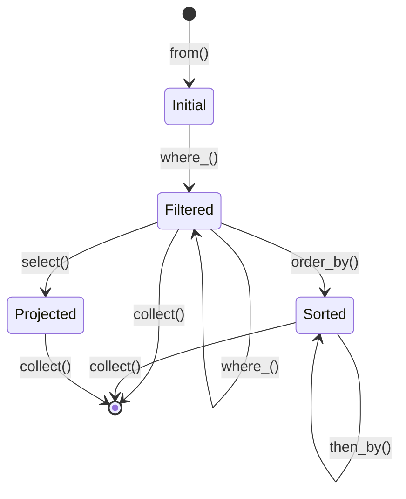

# RINQ (Rust Integrated Query)

[](https://github.com/kazuma0606/rusted-ca/actions)
[](LICENSE)
[](https://www.rust-lang.org/)

**RINQ (Rust Integrated Query)** は、Rustの型システムとゼロコスト抽象化を活用した、型安全で高性能なクエリエンジンです。C#のLINQから着想を得つつ、Rustの特性を最大限に活かした設計となっています。

## 🚀 プロジェクト概要

このリポジトリは、RINQクエリエンジンのコア実装を含む開発プロジェクトです。現在、In-Memoryコレクションに対する基本的なクエリ操作を提供し、将来のデータベース統合やWASM対応の基盤を構築しています。

### コア実装の場所

RINQのコア実装は以下のディレクトリにあります:

```
src/domain/rinq/
├── mod.rs           # モジュール定義
├── query_builder.rs # QueryBuilderのコア実装
├── state.rs         # 型状態パターンの定義
├── error.rs         # エラー型定義
├── tests.rs         # 単体テスト・プロパティテスト
└── README.md        # RINQ詳細ドキュメント
```

## ✨ 主な特徴

- **型安全性**: コンパイル時にクエリの正当性を保証
- **ゼロコスト抽象化**: 手書きループと同等のパフォーマンス
- **流暢なAPI**: メソッドチェーンによる読みやすいクエリ記述
- **型状態パターン**: 無効なクエリをコンパイル時に防止
- **プロパティベーステスト**: 100回以上の反復テストで正確性を保証

## 📦 クイックスタート

### 1. リポジトリのクローン

```sh
git clone https://github.com/kazuma0606/rusted-ca.git
cd rusted-ca
```

### 2. Rustツールチェーンのインストール

[Rust公式サイト](https://www.rust-lang.org/tools/install)の手順で`rustup`を導入してください。

### 3. ビルドとテスト

```sh
# 依存関係の取得
cargo fetch

# ビルド
cargo build

# RINQのテストを実行
cargo test rinq
```

## 🔧 基本的な使い方

```rust
use rusted_ca::domain::rinq::QueryBuilder;

fn main() {
    let data = vec![1, 2, 3, 4, 5, 6, 7, 8, 9, 10];
    
    // フィルタリングと変換
    let result: Vec<_> = QueryBuilder::from(data)
        .where_(|x| x % 2 == 0)  // 偶数のみ
        .select(|x| x * 2)        // 2倍にする
        .collect();
    
    println!("{:?}", result); // [4, 8, 12, 16, 20]
}
```

詳細な使用例は`examples/rinq_basic_usage.rs`を参照してください。

## 🏗️ アーキテクチャ

RINQは型状態パターンを使用して、コンパイル時にクエリの正当性を保証します:



## 📚 ドキュメント

- **設計ドキュメント**: `.kiro/specs/rinq-v0.1/design.md`
- **要件定義**: `.kiro/specs/rinq-v0.1/requirements.md`
- **実装タスク**: `.kiro/specs/rinq-v0.1/tasks.md`
- **RINQ README**: `src/domain/rinq/README.md`

## 🧪 テスト

RINQは包括的なテストスイートを備えています:

```sh
# すべてのRINQテストを実行
cargo test rinq

# プロパティベーステストのみ実行
cargo test --test rinq_property_tests

# 単体テストのみ実行
cargo test --lib domain::rinq::tests
```

### プロパティベーステスト

RINQは`proptest`を使用して、各プロパティを100回以上の反復でテストしています:

- **Property 1**: フィルタリングの正確性
- **Property 2**: 複数フィルタの結合
- **Property 3**: 不変性の保証
- **Property 6.4**: 型状態パターンによる有効なクエリ構築の強制

## 🛠️ 開発状況

現在、RINQ v0.1の開発を進めています。以下の機能が実装済みです:

- ✅ 基本的なクエリビルダー構造
- ✅ 型状態パターン
- ✅ フィルタリング機能 (`where_()`)
- ✅ プロパティベーステスト
- 🚧 ソート機能 (実装中)
- 🚧 ページネーション機能 (実装中)
- 🚧 集約機能 (実装中)

詳細な進捗状況は[GitHub Actions](https://github.com/kazuma0606/rusted-ca/actions)で確認できます。

## 🤝 コントリビューション

コントリビューションを歓迎します！以下の方法で参加できます:

1. Issueを作成して機能要望やバグを報告
2. Pull Requestを送信
3. ドキュメントの改善

## 📄 ライセンス

MIT License - 詳細は[LICENSE](LICENSE)ファイルを参照してください。

## 👤 Author

Yoshimura Hisanori

---

**Note**: このプロジェクトは現在開発中です。APIは変更される可能性があります。
